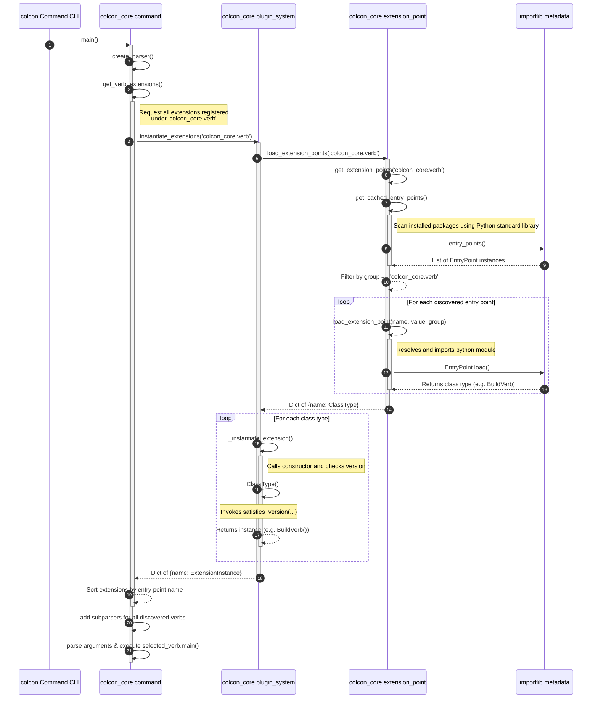

# Dissection of the Colcon Build System: Repository Breakdown and Interface Architecture

This document provides a comprehensive technical breakdown of the **colcon** build system. It is structured into two main sections:
1. **Repository Breakdown & Categorization**: Classification of the 22 repositories downloaded in the workspace.
2. **Interface & Extension Point Architecture**: A deep dive into how `colcon-core` defines, discovers, instantiates, and executes plugin-based extensions, followed by an end-to-end trace of `colcon-python-setup-py`'s registration.

---

## 1. Repository Breakdown & Categorization

Based on the contents of the `colcon.repos` file and the corresponding clones in the `src/` directory, we have classified the 22 repositories into 5 logical categories based on their primary operational role in the colcon ecosystem:

| Repository Name | Category | Primary Function / Role |
| :--- | :--- | :--- |
| **`colcon-core`** | **Core & CLI Framework** | The foundational framework and command-line interface. It includes the extension/plugin loading mechanism, the main CLI parser, the dependency topological sorter, and base task/verb definition structures. |
| **`colcon-defaults`** | **Core & CLI Framework** | Allows specifying default options for command-line arguments via configuration files (e.g., `defaults.yaml`), eliminating the need to type repetitive arguments. |
| **`colcon-devtools`** | **Core & CLI Framework** | Provides diagnostic and inspection commands for developers, such as printing lists of registered extension points, loaded plugins, and current environment details. |
| **`colcon-mixin`** | **Core & CLI Framework** | Implements "mixins," which are pre-defined, reusable sets of command-line arguments that can be modularly imported and mixed into active verb invocations. |
| **`colcon-package-information`** | **Package Identification & Discovery** | Exposes verbs and tools to query and print package structural data (e.g., dependency lists, source locations) without building. |
| **`colcon-package-selection`** | **Package Identification & Discovery** | Introduces selection flags (e.g., `--packages-select`, `--packages-up-to`, `--packages-skip`) to allow running verbs on a selective subset of the workspace. |
| **`colcon-recursive-crawl`** | **Package Identification & Discovery** | The default crawler that recursively traverses filesystem directories to discover packages by identifying markers (like `setup.py` or `package.xml`). |
| **`colcon-python-setup-py`** | **Package Identification & Discovery** | Specialized plugin to identify standard Python packages containing a `setup.py` script and extract their dependencies and metadata. |
| **`colcon-pkg-config`** | **Package Identification & Discovery** | Integrates metadata collection using `pkg-config` files to discover dependencies and export paths. |
| **`colcon-ros`** | **Package Identification & Discovery** | Essential extension for ROS (Robot Operating System). Detects `package.xml` files, differentiates ROS 1/ROS 2 packages, and configures build/test pipelines. |
| **`colcon-cmake`** | **Build & Test Tools** | Implements specialized tasks to configure, compile, install, and test CMake-based projects in the workspace. |
| **`colcon-parallel-executor`** | **Build & Test Tools** | The standard high-performance executor that compiles independent packages in parallel using a Directed Acyclic Graph (DAG) of the workspace dependencies. |
| **`colcon-test-result`** | **Build & Test Tools** | Aggregates and parses unit test result formats (e.g., JUnit XML) to report a clean summary of passed/failed assertions across all packages. |
| **`colcon-bash`** | **Environment & Shell Integration** | Shell integration for Bash. Generates setup scripts (e.g., `local_setup.bash`, `setup.bash`) to source the workspace and handles shell completion rules. |
| **`colcon-zsh`** | **Environment & Shell Integration** | Shell integration for Zsh. Handles configuration, workspace setup scripts, and shell completions specific to Zsh. |
| **`colcon-powershell`** | **Environment & Shell Integration** | Shell integration for Windows PowerShell. Generates setup `.ps1` files and supports environments running PowerShell. |
| **`colcon-argcomplete`** | **Environment & Shell Integration** | Generates dynamic command-line tab completion using the `argcomplete` Python library for bash/zsh. |
| **`colcon-cd`** | **Environment & Shell Integration** | Shell helper function providing a custom `colcon_cd` shell command to quickly jump the shell's active directory to a specified package path. |
| **`colcon-library-path`** | **Environment & Shell Integration** | Automatically adds shared library search paths (like `LD_LIBRARY_PATH` or `PATH`) to generated workspace setup scripts. |
| **`colcon-metadata`** | **Environment & Shell Integration** | Reads and resolves external metadata directories to inject custom properties or build parameters into packages. |
| **`colcon-output`** | **Output, Notifications & Style** | Customizes console output styles, isolates terminal stdout/stderr channels, and writes build logs into the `./log` subdirectory. |
| **`colcon-notification`** | **Output, Notifications & Style** | Uses desktop notification systems (like `notify-send` or OS-specific alerts) to popup statuses once a long-running build completes or fails. |

---

## 2. Dynamic Extension Point Architecture in `colcon-core`

Colcon utilizes an extremely elegant, decoupled architecture built entirely around python **entry points** (powered by `importlib.metadata`). 

### The Core Paradigm: How colcon defines an Extension Point

In `colcon-core`, an extension point is composed of three components:
1. **The Extension Point Group**: A unique string identifier representing the category of extension (e.g., `colcon_core.verb` or `colcon_core.package_identification`).
2. **The Base Interface Class**: A Python class that defines the functional contract (e.g., `VerbExtensionPoint`, `PackageIdentificationExtensionPoint`). It enforces an API contract, declares an `EXTENSION_POINT_VERSION` attribute, and has optional/abstract methods.
3. **The Master Registration (`colcon_core.extension_point`)**:
   In colcon, every extension point category is itself declared under a master entry point group named `colcon_core.extension_point`. This allows colcon to dynamically register and validate new *categories* of extension points, making the architecture fully self-describing.

> [!NOTE]
> This "double-indirection" means colcon is completely modular. Even core abstractions like verbs (`build`, `test`) or package discoverers are treated exactly like external plugins.

Here is the master registration in [colcon-core/setup.cfg](./src/colcon-core/setup.cfg):
```ini
[options.entry_points]
# Registering the extension point CATEGORIES and their associated interfaces
colcon_core.extension_point =
    colcon_core.argument_parser = colcon_core.argument_parser:ArgumentParserDecoratorExtensionPoint
    colcon_core.package_identification = colcon_core.package_identification:PackageIdentificationExtensionPoint
    colcon_core.task.build = colcon_core.task:TaskExtensionPoint
    colcon_core.verb = colcon_core.verb:VerbExtensionPoint
    # ... other extension points
```

---

### The Base Class & Versioning Contract

Every base interface class defines an `EXTENSION_POINT_VERSION`. Subclasses must verify their compatibility using the caret version range logic.

For instance, let's look at `VerbExtensionPoint` defined in [colcon_core/verb/\_\_init\_\_.py](./src/colcon-core/colcon_core/verb/__init__.py):
```python
class VerbExtensionPoint:
    """The interface for verb extensions (e.g. colcon build, colcon test)."""

    EXTENSION_POINT_VERSION = '1.0'

    def add_arguments(self, *, parser):
        """Add command line arguments specific to the verb."""
        pass

    def main(self, *, context):
        """Execute the verb extension logic."""
        raise NotImplementedError()
```

When an extension is loaded, its constructor validates its own compatibility using `satisfies_version(version, caret_range)` from `colcon_core.plugin_system`. This guarantees that if the core interface evolves (e.g., upgrading `EXTENSION_POINT_VERSION` to `2.0`), older incompatible plugins are safely ignored or reported instead of throwing unexpected runtime `AttributeError`s.

---

### Under the Hood: Dynamic Loading Sequence

When you invoke a command like `colcon build`, the following sequence unfolds:



---

### The Decorator Pattern in colcon-core

Colcon utilizes class decoration for command-line arguments using `GenericDecorator` defined in [colcon_core/generic_decorator.py](./src/colcon-core/colcon_core/generic_decorator.py). 

The class `ArgumentParserDecorator` (derived from `GenericDecorator`) wraps standard `argparse.ArgumentParser` instances. It intercepts calls to `add_argument()`, `add_argument_group()`, and `add_subparsers()` and recursively wraps nested parsers. 

This enables extensions registered under `colcon_core.argument_parser` (such as `colcon-argcomplete` or `colcon-defaults`) to transparently intercept and alter arguments at *any* point in the CLI hierarchy without having to manually patch the individual verb parser files.

---

## 3. End-to-End Trace: How `colcon-python-setup-py` Integrates

Let's trace how the `colcon-python-setup-py` repository hooks into `colcon-core`.

### Step A: Entry Point Declaration (`setup.cfg`)
In the extension repository ([colcon-python-setup-py/setup.cfg](./src/colcon-python-setup-py/setup.cfg)), the entry points are registered under standard groups defined by `colcon-core`:

```ini
[options.entry_points]
colcon_core.package_augmentation =
    python_setup_py = colcon_python_setup_py.package_augmentation.python_setup_py:PythonPackageAugmentation
colcon_core.package_identification =
    python_setup_py = colcon_python_setup_py.package_identification.python_setup_py:PythonPackageIdentification
```

Here, it exposes `PythonPackageIdentification` under the group `colcon_core.package_identification`.

---

### Step B: Extension Implementation
In [colcon_python_setup_py/package_identification/python_setup_py.py](./src/colcon-python-setup-py/colcon_python_setup_py/package_identification/python_setup_py.py), the extension class is declared. It derives from the core interface and implements the required API contract:

```python
from colcon_core.package_identification import PackageIdentificationExtensionPoint
from colcon_core.plugin_system import satisfies_version

class PythonPackageIdentification(PackageIdentificationExtensionPoint):
    """Identify Python packages with `setup.py` files."""

    # Priority determines order of execution. Lower priorities run later or allow overrides.
    PRIORITY = 90

    def __init__(self):
        super().__init__()
        # 1. Enforce version compatibility with Core interface 1.x
        satisfies_version(
            PackageIdentificationExtensionPoint.EXTENSION_POINT_VERSION,
            '^1.0')

    def identify(self, desc):
        # 2. Skip if package type is already resolved and it isn't python
        if desc.type is not None and desc.type != 'python':
            return

        # 3. Check for the marker setup.py file
        setup_py = desc.path / 'setup.py'
        if not setup_py.is_file():
            return

        # 4. Introspect setup.py (dry runs in a separate python sub-process)
        config = get_setup_information(setup_py)

        # 5. Augment package descriptor details
        desc.type = 'python'
        desc.name = config['metadata'].get('name')
```

---

### Step C: Resolution Trace during Workspace Crawling

When you run `colcon build`:
1. `colcon` initiates the crawling process to discover packages in the workspace directories.
2. The core package discovery module (`colcon_core.package_discovery.path`) invokes the core package identification subsystem.
3. `colcon_core.package_identification` calls `instantiate_extensions('colcon_core.package_identification')`.
4. `colcon-core`'s plugin loader scans the python environment, locates the entry point named `python_setup_py` in the `colcon-python-setup-py` installed egg-link/wheel, imports the module, verifies that it satisfies version `'^1.0'`, and instantiates `PythonPackageIdentification`.
5. The crawlers sort all discovered `PackageIdentification` extensions by their `PRIORITY` attribute.
6. The extensions are executed sequentially. `PythonPackageIdentification` runs, checks for the presence of a `setup.py` file, and resolves the package type, name, and dependencies.
7. `colcon-core` takes this uniform package descriptor representation and uses it to construct the build graph.
