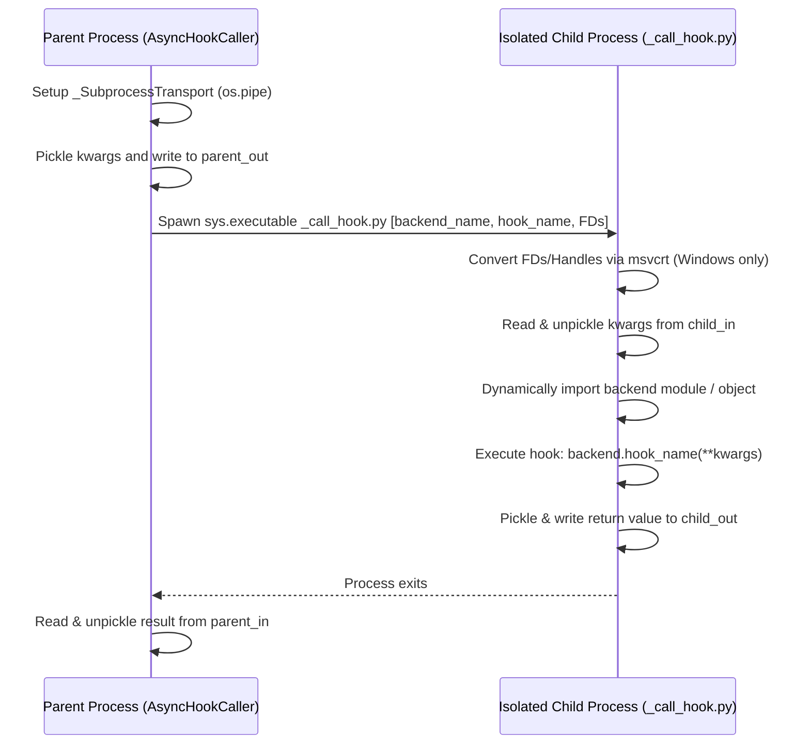

# PEP 517 PR Code Review: colcon-core PR #732

This document presents a deep, code-level technical review of Pull Request #732 from `colcon/colcon-core`, which introduces the foundational interfaces and subprocess hook callers to support PEP 517 build backend hooks. 

---

## 1. Architectural Role & Context

PR #732 acts as the central component enabling `colcon` to act as a standards-compliant PEP 517 **build frontend**. In a modern Python packaging ecosystem, instead of invoking legacy `setup.py` directly, a build frontend queries a build backend (e.g. `setuptools.build_meta`, `flit_core.buildapi`, or `hatchling.build`) defined in `pyproject.toml` to build source distributions (sdists) or binary wheels.

The PR implements the underlying invocation framework for these backend hooks, including an asynchronous execution wrapper and a decoration layer to allow backend-specific optimizations.

---

## 2. Detailed Interface and Extension Point Mapping

The PR adds two major components inside `colcon_core/python_project/`:
1. **The Hook Caller**: Subprocess-based execution transport.
2. **The Hook Caller Decorator Extension Point**: A new mechanism to augment backend hook invocations dynamically.

### Extension Point: `colcon_core.python_project.hook_caller_decorator`
* **File Path**: [__init__.py](file:///home/fede/Documents/colcon_source_dev/src/colcon-core/colcon_core/python_project/hook_caller_decorator/__init__.py)
* **Interface Class**: `HookCallerDecoratorExtensionPoint`
* **Core Contract**:
  ```python
  class HookCallerDecoratorExtensionPoint:
      EXTENSION_POINT_VERSION = '1.0'
      PRIORITY = 100
  
      def decorate_hook_caller(self, *, hook_caller):
          """
          Decorate a hook caller to perform additional functionality.
          :param hook_caller: The hook caller instance
          :returns: A decorated hook caller (subclass of GenericDecorator)
          """
          raise NotImplementedError()
  ```
* **Purpose**: This extension point allows third-party extensions to wrap the hook caller. This is vital for injecting setuptools-specific patches (e.g., maintaining feature parity with colcon's custom `--symlink-install` or managing temporary build output redirection).

### The Subprocess Transport: `AsyncHookCaller`
* **File Path**: [__init__.py](file:///home/fede/Documents/colcon_source_dev/src/colcon-core/colcon_core/python_project/hook_caller/__init__.py)
* **IPC mechanism**: Standard PEP 517 hooks may consume or return complex Python structures (e.g. dictionaries for `config_settings` or lists of requirements). Capturing standard stdout strings is highly fragile. To guarantee reliable communication, the PR introduces a binary pipe transport based on `pickle` serialization.
* **Pipeline Setup** (`_SubprocessTransport` context manager):
  Uses `os.pipe()` to establish two unidirectional channels:
  1. `self.child_in, self.parent_out = os.pipe()`: Parent writes `kwargs` payload -> Child reads.
  2. `self.parent_in, self.child_out = os.pipe()`: Child writes return `res` -> Parent reads.
  * *Windows Portability*: Employs `msvcrt` on Windows to convert standard file descriptors into OS-level handles and flags them as inheritable (`os.set_handle_inheritable`).



---

## 3. Comparison with Legacy `setup.cfg` Parsing

| Dimension | Legacy `setup.cfg` Support (Core) | Modern PEP 517 Support (PR #732) |
| :--- | :--- | :--- |
| **Parsing Target** | `setup.cfg` (INI file format). | `pyproject.toml` (TOML format). |
| **Parsing Mode** | **Static Parsing**: Directly imports `read_configuration` from `setuptools.config` to parse settings on the parent thread. | **Dynamic / Isolated Execution**: Spawns isolated subprocesses running helper script wrappers (`_list_hooks.py` and `_call_hook.py`) to import and query build backends. |
| **TOML Parser Engine** | N/A | [spec.py](file:///home/fede/Documents/colcon_source_dev/src/colcon-core/colcon_core/python_project/spec.py) implements `toml_loads` via `tomllib` (native in Python 3.11+) with fallbacks to `tomli` or standard `toml`. |
| **Default Fallback** | N/A | If `pyproject.toml` is absent, it defaults to: `build-backend = 'setuptools.build_meta:__legacy__'` and `requires = ['setuptools >= 40.8.0', 'wheel']`. |
| **IPC and Serialization** | N/A | Handled using standard library `pickle` streams over operating system pipes (`os.pipe`). |

---

## 4. Deep Technical Review & Architectural Risks

While the PR is clean and highly focused, several technical risks and missing integration pieces are evident when evaluated against colcon's standard build lifecycle:

### Risk 1: `sys.path` Pollution and Resolution Discrepancy
In [__init__.py](file:///home/fede/Documents/colcon_source_dev/src/colcon-core/colcon_core/python_project/hook_caller/__init__.py) line 125, `get_hook_caller()` adds custom `backend-path` elements to the beginning of the `PYTHONPATH` environment variable:
```python
pythonpath = kwargs['env'].get('PYTHONPATH', '')
kwargs['env']['PYTHONPATH'] = os.pathsep.join(
    backend_path + ([pythonpath] if pythonpath else []))
```
> [!CAUTION]
> **PEP 517 Compliance Issue**: The PEP 517 spec explicitly states that custom backend paths must be added to the front of `sys.path` when importing the backend. By modifying `PYTHONPATH` instead of directly manipulating `sys.path` inside the child process execution context:
> 1. Standard Python startup places the executing script's directory (`colcon_core/python_project/hook_caller/`) at `sys.path[0]`, potentially shadowing top-level package imports.
> 2. Flags like `-I` (isolated mode) could completely bypass `PYTHONPATH` variables, causing the build backend import to fail.

### Risk 2: Subprocess Performance Overhead
Spawning an entirely separate Python process for every backend hook invocation (e.g. `list_hooks`, then `get_requires_for_build_wheel`, then `build_wheel`) introduces substantial process spawning overhead. On Windows systems where process creation is expensive, compiling workspace setups with dozens of python packages will incur a significant performance penalty compared to legacy static parsing.

### Risk 3: IPC Serialization Boundaries (`pickle` limits)
The transport relies entirely on standard `pickle`. This creates two vulnerabilities:
1. **Unpicklable Arguments**: If any build backend hook expects or returns custom unpicklable structures (e.g., generator objects, complex file descriptors, or local lambda methods), the transport will crash during serialization.
2. **Import Failures on Exceptions**: If a custom backend hook raises a custom exception class not present in the parent `colcon` process's python environment, the parent process will raise an `UnpicklingError` instead of showing a clean execution error trace.

### Risk 4: Incomplete Build Lifecycle Integration (Missing Pieces)
> [!WARNING]
> PR #732 only implements the *hook calling mechanics* and *decorators*. It does **not** yet integrate these mechanisms into:
> * **Package Identification** ([colcon_core/package_identification/python.py](file:///home/fede/Documents/colcon_source_dev/src/colcon-core/colcon_core/package_identification/python.py)): Still ignores `pyproject.toml` packages if they don't have a matching `setup.py` / `setup.cfg`.
> * **Package Augmentation**: Still relies on setuptools `options` dict extraction.
> * **Build Execution Task** ([colcon_core/task/python/build.py](file:///home/fede/Documents/colcon_source_dev/src/colcon-core/colcon_core/task/python/build.py)): Still operates exclusively via `setup.py install/develop` command arrays.
> 
> Therefore, this PR is purely foundational and requires additional PR integrations to build actual packages in a workspace.

### Risk 5: Lack of Standardized Symlink (Editable) Support
Colcon relies heavily on `--symlink-install` (e.g. for development workflows). PEP 517 does not define a standard for editable installations; that is governed by the subsequent PEP 660 specification. 
Since editable hook calls (`build_editable`) are not standard across all old backends, the PR completely shifts the responsibility of resolving symlink installs to future hook decorators (`HookCallerDecoratorExtensionPoint`). If a decorator is not written for a backend, the package will fall back to a full wheel build and copy, breaking local rapid-development loops.
