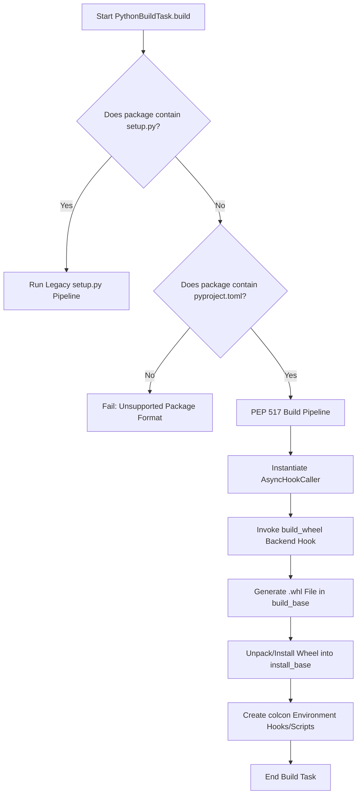

# 08: PEP 517 Build Task Design and Refactoring Blueprint

This document defines the architectural design, subprocess control flow, and installation logic required to implement **PR #2 (PEP 517 Standard Build Task)** inside `colcon-core`. This blueprint details how `colcon` will execute standardized Python package compilations using the `AsyncHookCaller` backend hooks and install the resulting binaries without relying on legacy `setup.py` invocations.

---

## 1. Technical Context & Limitations of Legacy Build Tasks

Currently, `colcon-core`'s build engine (`PythonBuildTask` in `colcon_core/task/python/build.py`) is tightly coupled with the historical `setuptools` command-line interface. It builds packages by running:
1.  **Non-Symlink Installation**: Spawns `python setup.py build` followed by `python setup.py install --single-version-externally-managed`.
2.  **Symlink (Editable) Installation**: Spawns `python setup.py develop --editable` inside the build space to register editable metadata without copying source files.

### The Problem
Pure PEP 517 packages (such as those using `hatchling`, `flit-core`, or modern `poetry-core`) **do not have a `setup.py`**. Executing the legacy task on these packages will crash instantly with a "file not found" exception. We must refactor the task execution layer to branch based on package configuration.

---

## 2. Proposed Architecture for PEP 517 Build Task

The updated build task will introduce a standards-compliant execution pipeline that leverages PEP 517 build hooks.



### 2.1 Control Flow Gating
Inside `colcon_core/task/python/build.py`, we will check if the package lacks a `setup.py` but was identified as a Python package via `pyproject.toml`:
```python
# Check if this package should be built via PEP 517
setup_py = Path(args.path) / 'setup.py'
pyproject_toml = Path(args.path) / 'pyproject.toml'
is_pep517 = pyproject_toml.is_file() and not setup_py.is_file()

if is_pep517:
    return await self._build_pep517(pkg, args, env, additional_hooks)
```

---

## 3. Subprocess Hook Caller & Wheel Installation Logic

### 3.1 Backend Hook Invocation
Inside `_build_pep517()`, `colcon` will interface with the package's build backend (e.g., `setuptools.build_meta`, `hatchling.build`, `flit_core.buildapi`) using the `AsyncHookCaller`:
1.  **Retrieve Hook Caller**:
    ```python
    from colcon_core.python_project.hook_caller import get_hook_caller
    caller = get_hook_caller(self.context.pkg, env=env)
    ```
2.  **Call Hook**:
    We invoke the standard `build_wheel` hook. This launches an isolated backend subprocess to compile the source code and output a standard binary wheel:
    ```python
    wheel_dir = os.path.join(args.build_base, 'wheel')
    os.makedirs(wheel_dir, exist_ok=True)
    
    # Returns the filename of the generated wheel relative to wheel_dir
    wheel_filename = await caller.call_hook(
        'build_wheel',
        wheel_directory=wheel_dir
    )
    wheel_path = os.path.join(wheel_dir, wheel_filename)
    ```

### 3.2 Wheel Unpacking and Target Installation
Once the backend generates the `.whl` package, `colcon` must install its contents into the workspace target `install_base`.
To prevent bringing in complex external packaging library dependencies (like `pip` internals), we can invoke the virtual environment's `pip` executable in an isolated subprocess to unpack and register the wheel:
```python
# Determine target library installation path
python_lib = os.path.join(args.install_base, self._get_python_lib(args))
os.makedirs(python_lib, exist_ok=True)

# Install wheel via pip in non-index, target-specific mode
pip_cmd = [
    sys.executable, '-m', 'pip',
    'install',
    '--no-index',
    '--no-deps',
    '--target', python_lib,
    wheel_path
]
completed = await run(self.context, pip_cmd, cwd=args.build_base, env=env)
if completed.returncode:
    return completed.returncode
```
*Why this works*: Using `--target` redirects the wheel unpacking directly into our target `install/` site-packages folder, matching the exact directory layout that downstream ROS 2 and python executables expect.

---

## 4. Gaps & Milestone Atomization

To ensure maximum safety and backward compatibility, the implementation of PR #2 will be divided into discrete milestones:

### Milestone 1: Wheel Generation & Standard Build Verification
*   **Goal**: Refactor the build task to successfully generate `.whl` files using `setuptools.build_meta`, `hatchling`, and `flit_core` and install them into target workspace paths.
*   **Verification**: 
    Verify that our bootstrapped `colcon build` can compile the new `pkg_pep517_setuptools`, `pkg_pep517_hatchling`, and `pkg_pep517_flit` packages, placing standard entry-point scripts in `install/` and site-packages in target directories.

### Milestone 2: PEP 660 Editable Installation & Symlinks
*   **Goal**: Integrate modern PEP 660 (`build_editable`) editable install hooks to support `colcon`'s `--symlink-install` option for backends that support editable wheels.
*   **Control Flow**:
    1. Check if backend implements `build_editable` hook using `await caller.list_hooks()`.
    2. If yes, invoke `await caller.call_hook('build_editable', wheel_directory=...)` to get an editable wheel, and install it.
    3. If no, fall back to standard `build_wheel` compilation and log a warning.

---

## 5. Sequential Testing Strategy

Once the refactoring is active, we will test the implementation sequentially in our local environment:

```bash
# 1. Re-bootstrap colcon from our local updated source code
./src/colcon-core/bin/colcon build --paths src/*
source install/local_setup.sh

# 2. Build the setuptools-backend PEP 517 mock package
colcon build --paths test_packages/pkg_pep517_setuptools
source install/local_setup.sh
hello-pep517-setuptools  # Should run and print successfully

# 3. Build the hatchling-backend PEP 517 mock package
colcon build --paths test_packages/pkg_pep517_hatchling
source install/local_setup.sh
hello-pep517-hatchling  # Should run and print successfully

# 4. Build the flit-backend PEP 517 mock package
colcon build --paths test_packages/pkg_pep517_flit
source install/local_setup.sh
hello-pep517-flit  # Should run and print successfully
```
