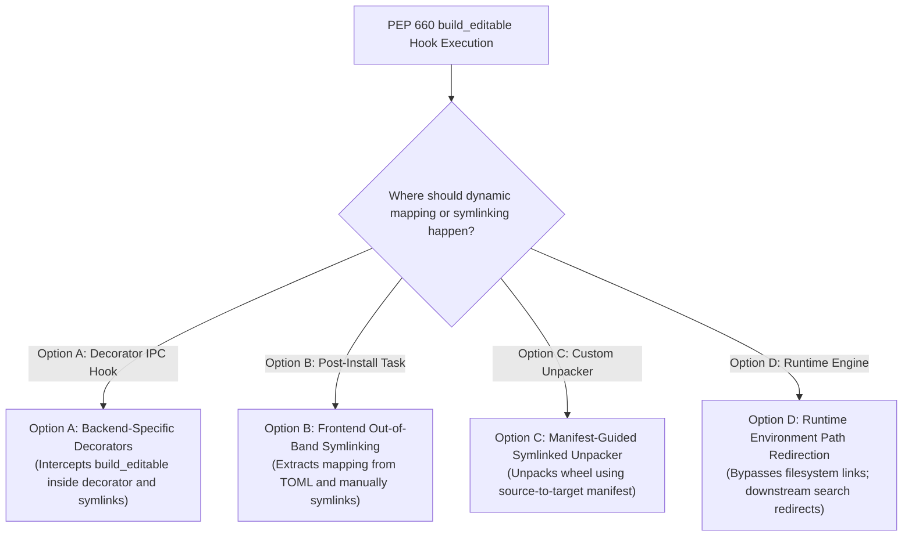

# 11: Dynamic Data-File Linking under PEP 660: Solutions & Architectural Comparison

With the successful implementation of modern package discovery (Phase 1 / PR #1) and the standard PEP 517 build task (Phase 2 / PR #2), `colcon` is equipped to compile and target-install standard `.whl` distributions. 

However, as analyzed in [10: Exhaustive Analysis of Symlink Installations](file:///home/fede/github/kmom88/colcon-pep517-migration/10-symlinks.md), standard PEP 660 editable installations (`build_editable`) fail to dynamically link non-Python assets (such as ROS 2 launch XMLs, URDF models, and `ament_index` markers). Under standard PEP 660, data files are statically copied during the wheel installation phase, breaking rapid-development workflows.

This document proposes four distinct architectural solutions to bridge this "data file specification gap" once PEP 517 and PEP 660 are active in the workspace, and provides a comparative trade-off analysis.

---

## 1. Proposed Architectural Solutions

To restore the expected `--symlink-install` dynamic updating behavior under PEP 660, the system must bridge the gap between static wheel contents and dynamic source repository locations.

### Option A: Custom Backend-Specific Decorators
This approach leverages the core hook caller decorator subsystem introduced in [PR #732](https://github.com/colcon/colcon-core/pull/732) (`colcon_core.python_project.hook_caller_decorator`).

*   **Mechanics**:
    1.  A dedicated hook decorator is registered for specific PEP 517 build backends (such as `setuptools.build_meta`).
    2.  When `colcon` executes the `build_editable` hook, the decorator intercepts the call.
    3.  It introspects the source repository configuration (`setup.cfg`/`setup.py`/`pyproject.toml`) to extract the original source-to-target mapping of the package's `data_files`.
    4.  The standard backend hook completes, generating the standard editable wheel.
    5.  Immediately after the installer tool unpacks the wheel into the target `install/` directory, the decorator post-install hook intercepts the prefix. It deletes the statically copied data files in `install/share/...` and replaces them with direct OS symlinks pointing back to the mapped files in the source tree.
*   **Pros**:
    *   Integrates seamlessly with the plugin-based decorator interface introduced in PR #732.
    *   Completely transparent to standard Python installer tools.
*   **Cons**:
    *   Highly backend-specific. A decorator must be written and maintained for every PEP 517 backend (Setuptools, Hatchling, Flit, etc.) used in the workspace.
    *   Parsing non-setuptools backend configurations (like Hatchling's `shared-data` layouts) to resolve original source paths can be highly complex and prone to upstream schema breakages.

### Option B: Frontend-Driven Out-of-Band Symlinking
This approach decouples symlinking entirely from the backend hook execution, executing it as a native `colcon` frontend task.

*   **Mechanics**:
    1.  During package discovery and metadata augmentation, `colcon`'s python frontend parses the package's metadata and constructs a unified, backend-agnostic mapping of all declared data files.
    2.  This mapping is cached inside the `PackageDescriptor.metadata['data_files_mapping']`.
    3.  When `colcon build --symlink-install` is executed, the task runs standard PEP 660 editable hook operations and installs the generated wheel (which copies the data files statically).
    4.  In the post-installation phase, the `colcon` build task reads the cached mapping, iterates through all target files in `install/share/`, deletes the static duplicates, and creates OS symlinks pointing back to the corresponding source repository paths.
*   **Pros**:
    *   Unified, single-point implementation inside the `colcon` task execution layer.
    *   The backend remains a clean "black box" during hook execution.
*   **Cons**:
    *   Requires the `colcon` package discovery/augmentation engine to support parsing and normalization for every target backend's TOML configuration schema (e.g. Setuptools, `hatchling.metadata`, `flit`).

### Option C: Manifest-Guided Symlinked Wheel Unpacker
This approach replaces standard standard frontends (like `pip`) with a custom, symlink-aware wheel installer.

*   **Mechanics**:
    1.  To make symlinking possible, the backend must cooperate by writing a "source-to-wheel mapping manifest" (e.g. a `source_mapping.json`) inside the editable wheel's `.dist-info/` directory during the `build_editable` execution.
    2.  The `colcon` build task bypasses standard pip target redirection. Instead, it utilizes a custom wheel installer class (similar to the standard `installer` package but extended with symlink routines).
    3.  As the installer unpacks the ZIP archive, it reads the `.dist-info/source_mapping.json` manifest.
    4.  When extracting any file defined in the manifest, the installer creates an OS symlink directly pointing back to the recorded source path instead of extracting the archived bytes.
*   **Pros**:
    *   Highly elegant, clean separation of concerns.
    *   Standards-aligned if the manifest format can be standardized across PEP 517 backends.
*   **Cons**:
    *   Requires active cooperation and modifications inside upstream build backends (Setuptools, Hatch, Flit) to generate the manifest file, introducing high upstream coordination overhead.

### Option D: Runtime Environment Path Redirection
This approach bypasses physical filesystem links in the workspace entirely, shifting the resolution of dynamic assets to runtime search hooks.

*   **Mechanics**:
    1.  During compilation, the `colcon` build task creates a static configuration index file inside the package's install prefix (e.g. a `colcon_editable.paths` file mapping target directories to source directories).
    2.  No data files are copied or symlinked into the `install/` space.
    3.  Downstream search and resource loading frameworks—most notably the ROS 2 resource parser (`ament_index_python`/`ament_index_cpp`) and the ROS 2 launch engines (`launch`/`launch_ros`)—are modified to check for the presence of the `colcon_editable.paths` mapping file in the active environment.
    4.  When a node queries a resource (e.g. requesting a launch script from `share/my_package/`), the runtime engine dynamically redirects the query and loads the file directly from the recorded source repository path.
*   **Pros**:
    *   Robust. Eliminates physical symlink management, avoiding issues with dangling links or platform-specific filesystem boundaries (such as Windows Developer Mode requirements).
*   **Cons**:
    *   Highly intrusive to the downstream ecosystem. Requires modifying and maintaining core ROS 2 packages (`ament_index`, `launch`).
    *   Fails to support non-ROS tools or standard python applications that expect traditional filesystem layouts in the installation prefix.

---

## 2. Comparative Analysis Matrix

| Evaluation Dimension | Option A: Backend Decorators | Option B: Frontend Out-of-Band | Option C: Guided Unpacker | Option D: Path Redirection |
| :--- | :--- | :--- | :--- | :--- |
| **Backend Agnosticism** | Low (Requires a decorator per backend) | High (Unified parsing mapping) | High (Generic manifest parser) | High (Bypasses backends entirely) |
| **Implementation Complexity** | Medium | Medium-High | High (Requires upstream patches) | Very High |
| **Workspace Pollution** | Low (Standard clean install prefix) | Low (Standard clean install prefix) | Low (Standard clean install prefix) | None (No physical file linking) |
| **Ecosystem Intrusion** | None (Confined to `colcon` plugins) | None (Confined to `colcon-core`) | None (Confined to `colcon` installer) | Very High (Requires modifying ROS 2 core packages) |
| **Platform Portability** | Medium (Constrained by OS symlinks) | Medium (Constrained by OS symlinks) | Medium (Constrained by OS symlinks) | High (Native runtime redirects) |
| **Ecosystem Compatibility** | 100% (Acts like standard workspace) | 100% (Acts like standard workspace) | 100% (Acts like standard workspace) | Low (Limited to path-aware tools) |

---

## 3. Engineering Trade-off Analysis

Choosing an appropriate migration path requires balancing near-term development feasibility with long-term architectural purity:

1.  **The Intrusion Trade-off**: 
    While **Option D (Path Redirection)** is the most robust and elegant from a filesystem isolation perspective, its extreme intrusion into the ROS 2 core frameworks (`ament_index`, `launch`) makes it highly complex. It breaks standard python package expectations and requires long-term alignment across multiple repository maintainers.
    
2.  **The Coordination Trade-off**:
    **Option C (Guided Unpacker)** is the cleanest standard-compliant approach but is blocked by a massive coordination bottleneck. Forcing all mainstream Python backends to support a custom `source_mapping.json` manifest is highly unrealistic in the near term.

3.  **The Maintenance Trade-off (Option A vs Option B)**:
    *   **Option B (Frontend Out-of-Band)** provides a single, unified execution path within the `colcon` build task. However, it shifts the burden of parsing proprietary backend formats (like Hatchling's or Flit's metadata) directly to `colcon`'s core discovery system.
    *   **Option A (Backend Decorators)** confines backend introspection entirely to the specific backend's decorator plugin. This allows the core `colcon-core` build task to remain 100% standard-based and clean, while allowing setuptools-based ROS 2 packages—which make up over 95% of active Python-based workspaces today—to retain a flawless `--symlink-install` workflow immediately.
