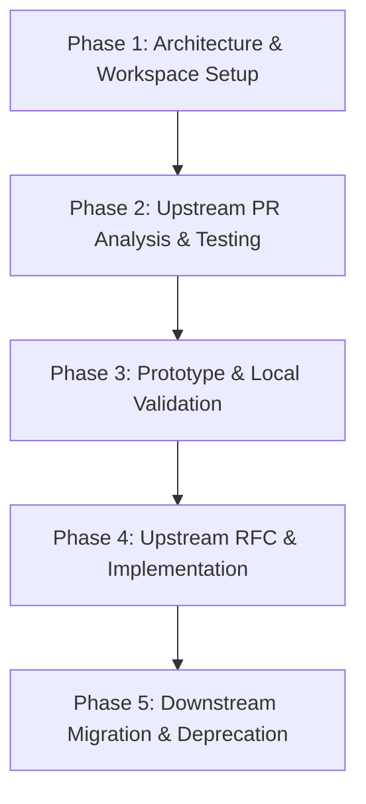

# colcon-pep517-migration

This repository serves as the central hub for analyzing, documenting, and executing the transition of the **colcon** build system from legacy `setup.cfg`/`setup.py` packaging mechanisms to modern PEP 517 standards. With upcoming upstream deprecations (e.g., in Fedora 43 and modern `setuptools`), aligning `colcon` with modern Python packaging standards is critical for long-term sustainability and compatibility.

## Table of Contents

- [Introduction](#introduction)
- [Workspace Setup](#workspace-setup)
- [Current Architecture Analysis](#current-architecture-analysis)
- [PEP 517 PR Evaluation](#pep-517-pr-evaluation)
- [Roadmap & Proposal](#roadmap--proposal)
  - [Migration Roadmap](#migration-roadmap)
  - [Actionable Milestones](#actionable-milestones)
  - [Upstream Proposal](#upstream-proposal)
- [How to Contribute](#how-to-contribute)

---

## Introduction

As the Python packaging ecosystem transitions away from legacy `setup.py` direct invocations and static `setup.cfg` configurations, modern standards like **PEP 517** (which defines build backend interfaces) and **PEP 518** (which specifies build system requirements) have become the default. 

This project is dedicated to orchestrating, documenting, and testing the migration of the core components of `colcon` to leverage PEP 517/518 build workflows natively.

---

## Workspace Setup

To ensure reproducible testing and isolation without polluting the host environment, this repository provides a dedicated workspace for building and evaluating `colcon` extensions from source.

- **Source-Based Bootstrapping**: We leverage `.repos` files (managed via `vcstool`) to define the precise revisions of `colcon-core`, `colcon-python-setup-py`, and other relevant extensions.
- **Isolated Environment & Step-by-Step Instructions**: Comprehensive step-by-step setup guides (virtual environment activation, `vcstool` importing, direct bootstrapping build, shell environment integration) are fully documented in the [Python Build Internals & Bootstrapping Dissection](02-python-build-internals.md#11-prerequisites--workspace-setup-steps).
- **Reproducible Verification**: By checking out and building all dependencies from source, engineers can easily inject local changes, test proposed PEP 517 backend changes, and verify integration across all package types.

---

## Current Architecture Analysis

The repository hosts deep-dive technical documentation analyzing how the legacy build system is currently structured and executed:

*   **[Repository Breakdown & Interface Architecture](01-colcon-interfaces.md)**: A deep dive into how `colcon-core` defines, discovers, instantiates, and executes plugin-based extensions across the 22 repositories in the ecosystem, and how external extensions (like `colcon-python-setup-py`) register and hook into the main build graph.
*   **[Python Build Internals & Bootstrapping Dissection](02-python-build-internals.md)**: A detailed, code-level analysis of how the workspace is bootstrapped, including a step-by-step breakdown of setup commands (virtual environment creation, `vcstool` cloning, package dependencies installation, direct-script building, and sourcing) as well as the runtime Python class mocking that drives the bootstrap.
*   **Limitations & Technical Debt**: Documentation detailing why the legacy approach is prone to breakage under modern Python versions, the reliance on deprecated `setuptools` internal APIs, and the necessity of migrating to a standard build backend interface.

---

## PEP 517 PR Evaluation

This section summarizes our technical review and validation of pending upstream pull requests and drafts aimed at introducing PEP 517 support to `colcon-core`:

*   **Backend Interface Review**: Evaluation of PEP 517 build backend integration inside `colcon-core`. This includes analyzing how build frontends (like `build` or `pip`) are invoked to build colcon-managed packages.
*   **Compatibility & Parity**: Assessing whether the proposed backend changes retain complete feature parity with legacy execution (e.g., handling of editable installs, developmental dependencies, and metadata parsing).
*   **Interoperability**: Investigating the impact on existing colcon extensions and downstream packages that depend on legacy build discovery structures.

---

## Roadmap & Proposal

To achieve a seamless transition without disrupting the ROS 2 and wider developer communities, we have outlined a multi-phase migration strategy.

### Migration Roadmap

1.  **Phase 1: Baseline & Tooling (Current)**: Establish the source-based workspace and document the current architecture.
2.  **Phase 2: PR Evaluation & Refinement**: Review, test, and contribute to the pending PEP 517 backend PRs in `colcon-core`.
3.  **Phase 3: Migration of Extensions**: Adapt the key python-related extensions (e.g., `colcon-python-setup-py`) to support PEP 517 backends natively.
4.  **Phase 4: Standardizing Build Backends**: Encourage package maintainers to specify standard PEP 517/518 build-systems in `pyproject.toml` instead of legacy setups.

### Actionable Milestones

| Milestone | Objective | Deliverables | Status |
| :--- | :--- | :--- | :--- |
| **M1: Isolated Workspace** | Provide stable `.repos` and setup scripts | Stable bootstrap environment | Done |
| **M2: Architecture Audit** | Complete deep-dive architectural docs | Core and Extension analysis reports | Done |
| **M3: Upstream PR Validation** | Evaluate PEP 517 PRs for backward compatibility | Foundational PEP 517 Identification (PR #1) | Done |
| **M4: PEP 517 Build Pipeline** | Implement standard build task in colcon-core | Subprocess build execution & wheel installs (PR #2) | In Progress |
| **M5: Upstream Issue Proposal** | Draft and submit official upstream migration issue | PEP 517 Roadmap Issue on `colcon/colcon-core` | Planned |

### Upstream Proposal

A key output of this repository is a formal issue proposal addressed to the `colcon` maintainers. This proposal highlights the urgency of upcoming platform-level deprecations:
*   **Fedora 43 & Modern Distributions**: Strict enforcement of PEP 517/518 packaging and the eventual complete removal of direct `setup.py install` support.
*   **Setuptools Modernization**: Deprecation of historical features that `colcon` relies on (e.g., custom easy-install setups).
*   **Action Plan**: The proposal outlines a concrete path toward making `pyproject.toml` the primary configuration file for all colcon extensions and user packages, securing long-term maintainability.
